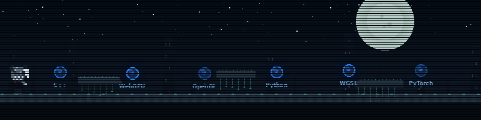

  

---

  
 
  # Miguel Garcia
  **Graphics & Rendering**
  
  &nbsp;Previously: **Full Stack Co-op @ Verizon** |
  &nbsp;**Computer Engineering and Computational Math** @ NJIT
  
  
  
  
  

---

### whoami

Computer Engineering student obsessed with breaking these systems apart to understand how they actually work. Currently deep in **graphics programming**, ML and rendering (3DGS, neural reconstruction).

Outside of that, I mentor SHPE members through the things nobody warns you about in college.

> Always down to talk graphics, game engines, or any idea that sounds genuinely interesting.

---

### Current Focus

<pre>
▸ Gaussian Splatting & neural rendering, Unreal Engine, Metal API
</pre>

---

### Tech Stack

**Languages**

**Tools & Frameworks**

<picture>
  <source media="(prefers-color-scheme: dark)" srcset="https://raw.githubusercontent.com/miguelagarcia-dev/miguelagarcia-dev/output/github-contribution-grid-snake-dark.svg" />
  
</picture>

  

